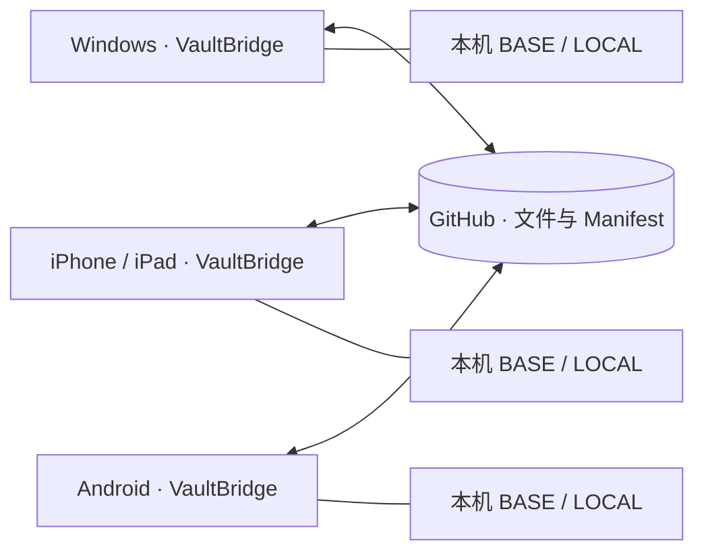

# VaultBridge

**通过 GitHub，在多台设备之间同步 Obsidian 笔记，并明确处理冲突、中断和验证。**

Stateful multi-device sync for Obsidian via GitHub, with three-way sync, conflict protection, recovery, and verification.

[下载安装包](https://github.com/ZainHuang/vaultbridge/releases/latest) · [报告问题](https://github.com/ZainHuang/vaultbridge/issues) · [升级兼容说明](docs/compatibility.md) · [安全说明](SECURITY.md)

VaultBridge 原名 **Local Mirror Sync**。显示名称已更新，插件 ID 仍为 `local-mirror-sync`，以保留已有设备的 Token、deviceId、BASE 和 Recovery。**升级时只覆盖三个插件文件，不要卸载或重命名原插件目录。**

## What it is · 它是什么

VaultBridge 是 Obsidian 插件，支持桌面和移动端运行。每台设备保留自己的同步历史，通过同一个 GitHub 仓库交换笔记、附件和文件身份信息。不需要在手机安装 Git、Node.js 或运行服务器。

GitHub 是设备之间的**中央同步媒介**，不仅是单向备份：一台设备发布的修改、重命名和删除，可以经审阅后应用到另一台设备。请为笔记创建单独的**私有仓库**，不要把个人 Vault 上传到这个公开插件源码仓库。

## Why VaultBridge · 为什么不用普通 Git merge

Git 工作流适合版本控制，但文本 merge 不能单独解决多设备文件同步的所有问题：新手机没有历史时如何判断远端文件、删除是否来自已知旧版本、附件冲突时该保留哪份、上传后应用被关闭如何继续。

VaultBridge 不运行 `git pull` / `git merge`，也不把它们当作同步协议。它比较 **BASE / LOCAL / REMOTE**，再生成可审阅的文件操作。正文和二进制都不自动合并；两端冲突时不会按修改时间猜赢家，也不采用 **last-writer-wins**。

## Core features · 核心功能

- Stateful Three-Way Sync：推送、拉取、新增、修改、删除和重命名。
- 稳定文件身份，支持有身份依据的 Rename / Rename+Update。
- Tombstone 删除记录，防止旧设备把已删除文件重新上传。
- 首台设备初始化、新设备下载、已有 Vault 接入和旧仓库接管。
- 显式冲突审阅、默认关闭的 Safe Auto Sync、每次同步后的 Verify。
- 可恢复事务、Dashboard、本机 Sync History 和设备信息。
- Windows、iOS、Android 使用同一个插件 bundle。

## How synchronization works · 同步如何工作



| 名称 | 含义 |
| --- | --- |
| **BASE** | 这台设备上次通过同步验证的共同版本；各设备独立保存 |
| **LOCAL** | 当前设备上的文件实际内容 |
| **REMOTE** | GitHub 目标分支上的文件及已验证的 Manifest |

例如：手机的 LOCAL 没变，而 REMOTE 相对 BASE 更新了，计划会显示拉取；电脑的 LOCAL 更新而 REMOTE 没变，则显示推送。双方把同一文件改成不同内容时，要求处理冲突。

删除不是“某一边没有文件就删掉另一边”。插件结合 **BASE、稳定 fileId 和 Tombstone** 判断删除来源。没有 BASE 的新设备，不会因为本地为空就推断应当清空 GitHub。

日常流程：**Preview → 审阅操作与冲突 → Sync & Verify → 保存并读回 BASE**。需要发布时，文件与 Manifest 放在同一个 GitHub commit 中，分支更新使用 `force:false`。

手机端点击文件可打开独立大弹窗，查看两端内容并选择 **Use LOCAL / Use REMOTE**。也可以使用 **Use LOCAL / REMOTE for all conflicts** 一次选择当前预览中的全部冲突（含被筛选隐藏的冲突）；非冲突项继续按原计划同步。LOCAL 指当前设备，REMOTE 指 GitHub。这些按钮只更新预览，仍需点击 **Sync & Verify** 才执行。

身份不确定的文件也支持明确选边：保留无身份的本地文件会分配新 ID，不推断重命名；选择某端也包含该端的文件缺失状态，因此可能产生删除。预览会列出操作并保留删除确认、事务备份和 Verify。若所选结果仍存在重复路径或无法写入的路径，会显示具体诊断；Manifest 等仓库级错误仍须先修复。

## Safety model · 安全边界

- 冲突不静默覆盖；需要逐文件选择，无法确认身份或路径时保持阻断。
- 执行前重查本地内容、远端 HEAD 和同步范围；预览过期需要重新预览。
- 本地破坏性操作保留恢复副本；旧仓库接管还先建立并核验 GitHub 备份分支。
- **Verify 成功后才推进 BASE**；失败或中断保留恢复记录，不伪造成功。
- 已发布且没有本地写入的事务，Recovery 可核验已发布快照并建立该快照的 BASE，同时保留后续新编辑，交给下一次 Preview；不会覆盖新编辑来制造“一致”。
- 同步不是实时协同编辑，没有“绝不会丢数据”的保证。保留独立备份；不要让其他双向同步插件、Git 自动提交工具或云盘同时写同一 Vault。

## Installation · 安装与升级

需要 Obsidian **1.6.0 或更新版本**，建议使用当前稳定版。VaultBridge 尚未提交 Obsidian 社区插件目录审核。

### Windows / Android：安装 Release

1. 从 [最新 Release](https://github.com/ZainHuang/vaultbridge/releases/latest) 下载 `vaultbridge-1.1.14.zip`，不要下载 GitHub 自动生成的 Source code 压缩包。
2. 解压后得到 `local-mirror-sync` 文件夹，里面是 `main.js`、`manifest.json`、`styles.css`。
3. 放入 Vault 的 `.obsidian/plugins/`。Android 文件管理器可能需要开启“显示隐藏文件”。自定义 Obsidian 配置目录时，用它替代 `.obsidian`。
4. 重启 Obsidian，在 **Settings → Community plugins** 中允许社区插件并启用 **VaultBridge**。

```text
YourVault/
  .obsidian/plugins/local-mirror-sync/
    main.js
    manifest.json
    styles.css
```

升级 Local Mirror Sync：停用插件，只覆盖上述三个文件，再启用。**保留 `data.json`、`sync-state.json`、`device-state.json`、`product-state.json`、`.sync-history/` 和 `.local-mirror-sync/`。** 有 Pending Recovery 时，升级后继续 Review Recovery。

### iOS / iPadOS：通过 BRAT 安装

iOS 文件应用不便直接管理隐藏插件目录。可以在 Obsidian 社区插件中安装并启用 **BRAT**，在其设置中选择添加 beta 插件，填写 `https://github.com/ZainHuang/vaultbridge`，选择最新 Release 后启用 VaultBridge。Windows、Android 也可使用此方法，具体界面参见 [BRAT 官方指南](https://github.com/TfTHacker/obsidian42-brat)。

BRAT 负责插件安装更新；笔记仓库 Token 在 **VaultBridge 设置**里配置。公开插件的安装不需要你的笔记仓库 Token。更新时保留原插件 ID，不要先卸载。

## GitHub setup · 配置 GitHub

### 创建笔记仓库

在自己的 GitHub 账号下创建单独的 **Private** 仓库，例如 `my-vault`，分支用 `main`。勾选创建 README，确保至少有一次提交。插件不创建仓库，也不会把不存在的分支或访问错误当作空仓库。

初始 README 会使仓库进入下文的 **Legacy Adoption** 流程，这是正常情况。你将在审阅时明确决定以现有本地笔记还是 GitHub 内容为准。

### 创建 fine-grained Personal Access Token

1. 打开 GitHub **Settings → Developer settings → Personal access tokens → Fine-grained tokens → Generate new token**。
2. 设置名称、合适的到期时间和 Resource owner。
3. Repository access 选 **Only select repositories**，只授权你的笔记仓库。
4. Repository permissions 设置 **Contents: Read and write**，保留必需的 Metadata 读取权限。
5. 生成 Token，填入 VaultBridge 的 **GitHub Token**，点击 **Save settings**。建议每台设备单独创建，便于分别撤销。

组织仓库可能需要管理员批准。若同步 `.github/workflows/`，还需对应 Workflows 权限；普通笔记可直接忽略该目录。参见 [GitHub Token 指南](https://docs.github.com/en/authentication/keeping-your-account-and-data-secure/managing-your-personal-access-tokens) 与 [权限说明](https://docs.github.com/en/rest/authentication/permissions-required-for-fine-grained-personal-access-tokens)。

| 插件设置 | 示例 / 建议 |
| --- | --- |
| GitHub Owner | 你的 GitHub 用户名或组织名 |
| Repository | `my-vault`，只填仓库名 |
| Branch | `main`，必须已存在 |
| GitHub Token | 上一步生成的 Token |
| Device name / type | 如 `Home-PC` / Desktop、`Phone` / Mobile；不要填敏感信息 |
| Include .obsidian | 默认关闭，首次使用建议保持关闭 |
| Ignore Patterns | 每行一条；各设备保持一致 |
| Auto Sync | 初始化时保持关闭 |

Token 优先使用 Obsidian SecretStorage；不可用时设置页会提示保存到本机插件 `data.json`。不要复制该文件到其他设备。Token 输入框留着不动会保留凭据，主动清空后保存会清除它。

## First device setup · 初始化第一台设备

1. 备份现有 Vault，安装插件，完成并保存 GitHub 设置。
2. 运行命令 **VaultBridge: Initialize / Adopt Vault** 或 **Preview Sync**。
3. 根据预览模式操作：

| 模式 | 出现条件 | 操作 |
| --- | --- | --- |
| INITIALIZE | 无 BASE，目标分支同步范围内无用户文件 | 审阅上传列表，执行 **Sync & Verify** 创建 Manifest |
| ADOPT / Legacy repository | 无 BASE，GitHub 有文件但无 Manifest | 明确选 **Use Local** 或 **Use Remote** 后接管 |
| BOOTSTRAP / ATTACH | GitHub 已有有效 Manifest | 按下一节新设备步骤操作 |

**Use Local** 让远端同步范围与本地一致，包括覆盖远端内容、删除远端独有文件。**Use Remote** 让本地同步范围与远端一致，包括覆盖本地内容、移除本地独有文件。先审阅全部影响，再准确输入 `USE LOCAL` 或 `USE REMOTE`，点击 **Adopt & Verify**。

如果完整笔记都在第一台电脑，GitHub 只有初始化 README，通常应审阅 **Use Local**，列表也会显示移除该 README。全局选边仅用于无 BASE、无 Manifest 的旧仓库接管；它不是以后每次同步的固定策略。

确认成功提示、BASE generation 和 Dashboard 验证状态后，再添加下一台设备。

## Add a new device · 添加新设备

1. 在 Windows、iPhone 或 Android 创建独立 Vault，安装插件。
2. 只安装三个代码文件，**不复制旧设备的 Token、BASE、deviceId、历史或 Recovery**。
3. 填写相同 Owner / Repository / Branch，使用本设备 Token，匹配同步范围。
4. 运行 **Initialize / Adopt Vault** 或设置中的 **Initialize from GitHub**。
5. 空 Vault + 有效远端 Manifest 会进入 **BOOTSTRAP**，审阅下载清单，执行 **Sync & Verify**。本地已有文件则进入 **ATTACH**，保留双方合集，逐项处理同路径不同内容冲突。
6. 等待 Verify 成功；新设备有独立的 deviceId 和 BASE。

不要删除 `sync-state.json` 来“重置”旧设备，这会丢失判断删除和冲突的历史。有 BASE 而远端 Manifest 缺失/损坏时，插件保持阻断，不会自动接管。

## Manual Sync · 手动同步

运行 **VaultBridge: Sync (review first)**，先看推送、拉取、删除、重命名及冲突；列表仅显示变动文档，每页 10 条。再点击 **Sync & Verify**。超过 Delete Safety Threshold 的移除路径会弹出确认窗口，要求准确输入 `DELETE N`；默认阈值 20，重命名源路径也计入。

建议开始编辑前检查远端，结束后再同步。等待同步结束再关闭应用；预览后内容改变就重新 Preview。

**Open Dashboard** 显示缓存的仓库、文件数、设备、健康状态和 Recovery。独立的 **Sync History** 页面显示本机最近 100 条已验证事务，旧 JSON 仍保留。打开这两个页面不请求 GitHub，显示的不是实时在线状态；运行 Preview 才检查远端。

## Auto Sync · 自动同步

默认 **OFF**。完成初始化和一次手动同步后，可在设置中启用并保存。Vault 新增、修改、删除、重命名事件默认等待 **30 秒**再检查，只执行小规模、无冲突且通过安全检查的计划；默认最多 **5 个移除路径、20 个变化文件**。

Auto Sync 不定时轮询 GitHub，单纯打开 Obsidian 不会自动扫描或拉取。冲突、远端 Manifest 相对 BASE 变化、初始化、Adoption、范围变化、Recovery 或超阈值时，会暂停要求人工审阅。查看 Dashboard 原因，运行手动 Preview；暂停不等于同步完成。

## Verify · 验证

执行同步时，自动核验远端提交/Tree/Manifest、本地相关字节，以及写入后的同步状态。**验证成功才更新 BASE、记录成功历史。**

**Verify Sync (read-only)** 是只读状态检查，没有执行按钮，不下载、上传、解决冲突或推进 BASE。发现差异后回到普通 Preview；它不能替代 **Sync & Verify**。

## Conflict handling · 处理冲突

1. 阅读冲突路径，重要内容先另存副本。
2. 点击 **Inspect both versions** 比较双方内容。
3. 对支持选边的冲突逐项选择 **Use LOCAL** / **Use REMOTE**。选边只改变计划，最后仍需确认 **Sync & Verify**。
4. 两边编辑都需要时，先在独立副本里人工合并，再按审阅流程保存最终内容；插件不自动做文本 merge。

大小写/Unicode 冲突、身份不确定或路径碰撞不能强行选边。先恢复可确认的路径，或在 Obsidian 明确重命名后重试；不要删除 Manifest 或 BASE 隐藏冲突。

## Recovery · 处理同步中断

网络中断、应用退出或验证失败后可能显示 **Pending Recovery**，意味着有待核查的事务，不一定意味着文件已损坏。

1. 停止新同步，保留 `.local-mirror-sync/transactions/`。
2. 从 Dashboard 或 **Recover interrupted sync** 打开 **Review Recovery**，核对仓库、事务 ID、阶段和错误。
3. 通常使用 **Resume Transaction**：它重查目标、提交、备份和本地状态，继续或完成验证。若仅创建对象失败、还没有候选提交，Resume 会安全清除 pending，随后重新 Preview。
4. **Abort Transaction** 仅在尚未发布、仍为 prepared 且远端 HEAD 未变化时允许。它只移除活动指针、保留备份，不回滚笔记、BASE 或 GitHub；发布后不能用 Abort 撤销提交。

`RECOVERY_ENV_CHANGED`：先核对原仓库/分支、网络和新编辑，保留独立副本，不删除恢复目录绕过保护。旧格式事务若提示 `LEGACY_CURRENT_STATE_DIFFERS`，只在界面提供时用 **Start fresh Preview from current HEAD**；它保留原 BASE 和旧事务审计，不代表旧事务已验证成功。

恢复目录可能包含笔记原文，不自动清理。不要公开上传或单独删除被 journal 引用的 objects。无法判断时，提供脱敏错误码、版本和步骤到 Issues，不附整个 Vault、Token 或 Recovery。

## Ignore rules / large files · 忽略规则和大文件

先读取 Vault 根目录 `.gitignore`，再应用设置 **Ignore Patterns**，每行一条 Git 风格规则：

```gitignore
*.mp3
*.m4a
*.wav
private/**
.github/workflows/**
```

音频只有匹配规则才会忽略。单个同步文件上限 **20 MiB**，Manifest 上限 **2 MiB**；大附件需忽略或另行管理。

`.git/`、`.trash/`、本插件目录、Token/状态、Recovery、本机历史、Obsidian workspace/cache 永久保护，`!**` 也不能重新纳入。`.obsidian` 默认不参与同步，开启后仍保留上述排除。

改范围可能触发 **SCOPE_REVIEW**，要求审阅而不推断删除。各设备保持规则一致；扩大范围后出现 Manifest 未跟踪的远端文件会阻断，不静默吸收。

## Mobile usage · 移动端

Windows、iOS、Android 使用相同 Web/Obsidian Vault API，无 Node-only 运行时依赖。手机可从命令面板、设置和 ribbon 图标进入。

同步期间保持 Obsidian 前台、网络可用。系统可能暂停后台应用；Auto Sync 不是系统后台服务。切换设备后先手动 Preview 获取远端变化，每台手机独立初始化。

测试覆盖 Windows 真机 Obsidian、HTTP 仿真集成和窄屏/mobile emulation；**实体 iPhone / Android 尚未验收**，模拟结果不代表实体设备保证。请先用测试 Vault 验证自己的环境。

## Security · 安全与隐私

VaultBridge 直接通过 HTTPS 访问 `api.github.com`，无需中转服务器。GitHub 上的笔记**不经过本插件端到端加密**，有仓库权限的账号可读取；使用私有笔记仓库。

不要分享 Token、`data.json`、完整 Recovery 或未脱敏日志。SecretStorage 可用性取决于 Obsidian，本地回退不是加密保险箱。设备名、deviceId 和设备报告会随相关推送写入笔记仓库。详见 [SECURITY.md](SECURITY.md)。

## Troubleshooting · 常见问题

| 现象 | 处理 |
| --- | --- |
| 401 / 403 | 检查 Token 到期、仓库授权、Contents 权限、组织审批或限流 |
| 404 / 409 或读不到分支 | 核对 Owner / Repository / Branch、访问权限及初始提交 |
| Auto Sync 没拉取其他设备的修改 | 它不轮询，运行手动 Preview |
| Preview 过期 | 关闭旧预览并重新生成 |
| Pending Recovery | Review Recovery → 按情况 Resume / Abort，不删恢复目录 |
| Manifest / Tree 不一致 | 停止其他工具写入 GitHub，保留现场并求助，不伪造 Manifest |
| LOCAL_STATE_INVALID | 保留 state 和 Recovery，不删 state 假装成新设备 |
| 新手机存在同名不同内容文件 | ATTACH 后逐项处理冲突，或先另存独立备份 |
| 大文件 / 非法路径 | 忽略或拆分超限文件，处理大小写/Unicode 和 Windows 非法名称；不支持符号链接/子模块 |
| Dashboard 看起来过时 | 它是本机缓存，运行 Preview |

报告问题请提供插件/Obsidian版本、平台、错误码和合成笔记复现步骤，不粘贴 Token 或真实私人笔记。

## Development / Build · 开发与构建

需要 Node.js **24+**、npm，依赖已锁定：

```sh
npm ci
npm run typecheck
npm run lint
npm test
npm run test:property
npm run build
```

`npm test` 自动生成合成 fixtures。fixtures、profile、日志、截图、Recovery 和构建输出均不提交。bundle 位于 `dist/vaultbridge/`，唯一运行时外部依赖为 `obsidian`。

Windows 真实应用集成测试使用独立生成的 Vault/profile 和本机 HTTP GitHub 仿真：

```powershell
$env:OBSIDIAN_EXE = 'C:\Path\To\Obsidian.exe'
$env:LMS_SKIP_LIVE_GITHUB = '1'
npm run fixtures
npm run test:obsidian
npm run test:obsidian:v1
npm run test:obsidian:v11
npm run test:obsidian:v111
npm run test:obsidian:v112
npm run test:obsidian:v113
npm run test:obsidian:v114
npm run test:obsidian:activity
npm run test:obsidian:lifecycle
npm run test:obsidian:dashboard
npm run test:obsidian:publish
npm run test:obsidian:manifest
npm run test:obsidian:brand
```

这些套件共用固定测试端口，应顺序运行，不连接个人 Obsidian 会话。公开 CI 执行 typecheck、lint、unit/property tests、build 和公开文件审计；真实 Obsidian 测试需在已安装应用的 Windows 环境执行。

构建后执行 `powershell -NoProfile -File scripts/package-release.ps1`，生成安装 zip 和 `SHA256SUMS.txt`。zip 内仍用兼容目录 `local-mirror-sync`。在 Git checkout 中运行 `npm run audit:public` 检查跟踪文件和 bundle；只输出路径/规则，不输出疑似秘密内容，仍需人工审阅。

改动应保持协议和状态兼容，新增行为先写回归测试。参见 [兼容契约](docs/compatibility.md) 和 [验证范围](docs/validation.md)。

## License · 许可

[MIT License](LICENSE)。bundle 保留 `@noble/hashes` 和 `ignore` 的第三方许可证声明。
